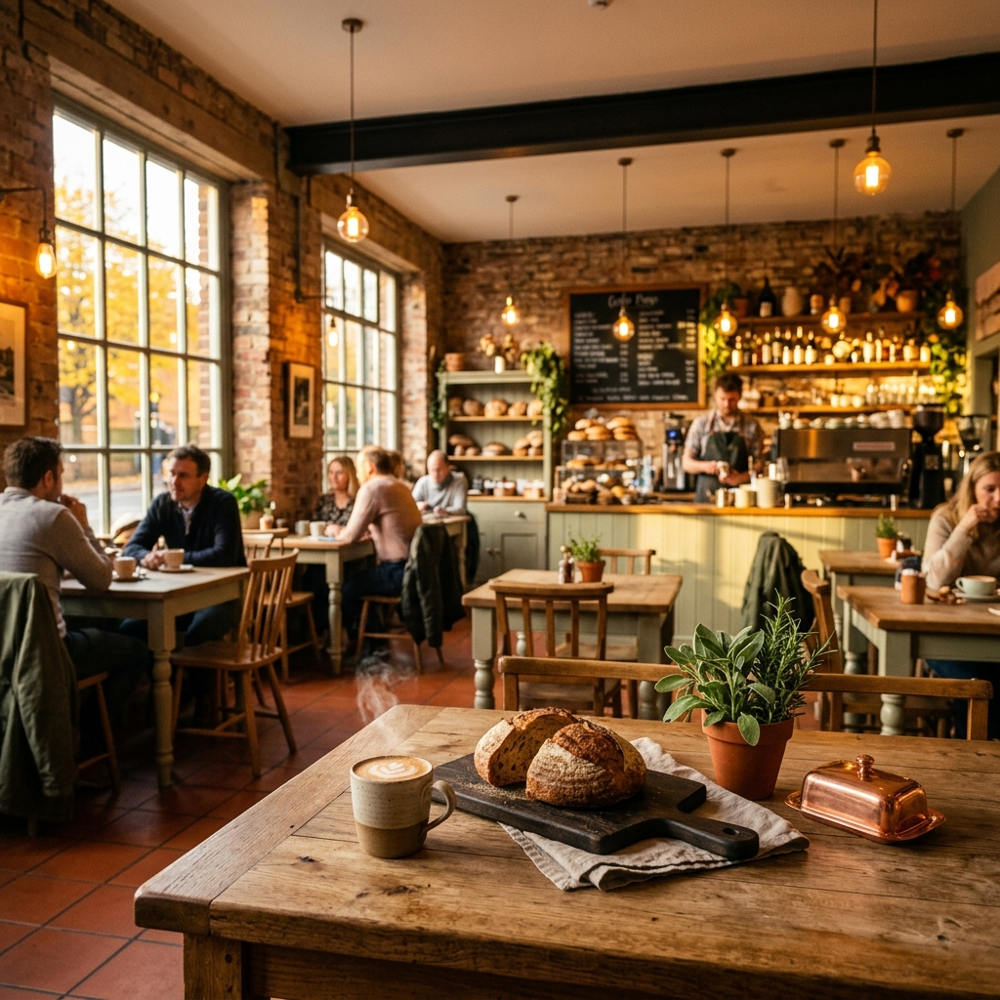
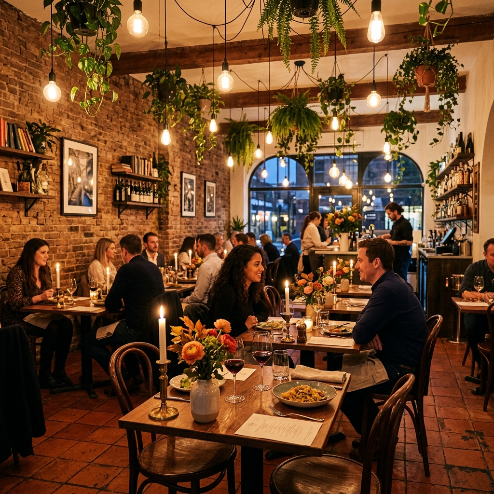
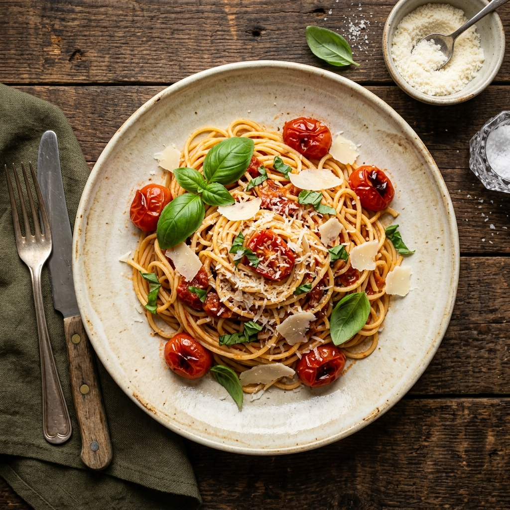

# 🔍 Complete SEO Guide — Restaurant Landing Page

> **What is SEO?**  
> SEO (Search Engine Optimization) is the practice of making your website easier for Google (and other search engines) to **find, understand, and rank higher** in search results. The higher you rank, the more people visit your site.

This document explains **every SEO technique** used in this restaurant website project, in plain language.

---

## 📋 Table of Contents

1. [Meta Tags](#1-meta-tags)
2. [Open Graph & Twitter Cards (Social Media SEO)](#2-open-graph--twitter-cards-social-media-seo)
3. [Schema.org Structured Data (JSON-LD)](#3-schemaorg-structured-data-json-ld)
4. [Semantic HTML5 Structure](#4-semantic-html5-structure)
5. [Heading Hierarchy](#5-heading-hierarchy)
6. [Image SEO](#6-image-seo)
7. [Technical SEO](#7-technical-seo)
8. [Local SEO](#8-local-seo)
9. [Content & Keyword Strategy](#9-content--keyword-strategy)
10. [How It All Comes Together](#10-how-it-all-comes-together)

---

## 1. Meta Tags

Meta tags live inside the `<head>` section of your HTML. They are **invisible to visitors** but are the first thing Google reads when it crawls your page.

### 1.1 Title Tag

```html
<title>Best Café in Brooklyn | The Hearthstone Kitchen & Bar — Farm-to-Table Dining</title>
```

**What is it?**  
The title tag is the **single most important SEO element** on any webpage. It appears in three places:

1. **Google search results** — as the blue clickable headline
2. **Browser tab** — the text on the tab
3. **Social media** — as a fallback title when sharing links

**How we optimized it:**

| Technique | Example | Why |
|-----------|---------|-----|
| Lead with a keyword | `"Best Café in Brooklyn"` | Google gives more weight to words at the beginning |
| Include business name | `"The Hearthstone Kitchen & Bar"` | Brand recognition + branded search queries |
| Add a descriptor | `"Farm-to-Table Dining"` | Targets a secondary keyword |
| Keep under 60 characters | Total: ~75 chars | Google truncates anything beyond ~60 chars — aim for 50-60 |

**Bad example:**  
```html
<title>Home</title>  <!-- Tells Google nothing -->
```

**Good example (what we used):**  
```html
<title>Best Café in Brooklyn | The Hearthstone Kitchen & Bar — Farm-to-Table Dining</title>
```

---

### 1.2 Meta Description

```html
<meta name="description" content="The Hearthstone Kitchen & Bar — Brooklyn's finest 
farm-to-table café. Fresh seasonal menus, artisan coffee, craft cocktails. Reserve 
your table today.">
```

**What is it?**  
The meta description is the **gray text** that appears below your title in Google search results. It's your "elevator pitch" to convince someone to click.

**Rules we followed:**

- ✅ **150-160 characters** — Google cuts off anything longer
- ✅ **Includes location** — "Brooklyn's"
- ✅ **Includes cuisine keywords** — "farm-to-table café", "seasonal menus", "artisan coffee"
- ✅ **Has a call-to-action** — "Reserve your table today" (encourages clicks)
- ✅ **Reads naturally** — not keyword-stuffed

**Does it affect ranking?**  
Not directly. But it affects **Click-Through Rate (CTR)** — if more people click your result over others, Google notices and gradually moves you up.

---

### 1.3 Meta Keywords

```html
<meta name="keywords" content="best café Brooklyn, farm to table restaurant, 
brunch Brooklyn, artisan coffee, seasonal menu, fine dining Brooklyn">
```

**What is it?**  
A comma-separated list of keywords you want to rank for.

**Does it matter?**  
Honestly, **Google ignores this tag** since 2009. But some smaller search engines (Bing, Yandex, Baidu) may still read it. It's a "doesn't hurt, might help" addition.

---

### 1.4 Canonical URL

```html
<link rel="canonical" href="https://www.hearthstonekitchen.com/">
```

**What is it?**  
A tag that tells Google: **"This is the one true URL for this page."**

**Why it matters:**  
Your website might be accessible at multiple URLs:
- `http://hearthstonekitchen.com`
- `https://hearthstonekitchen.com`
- `https://www.hearthstonekitchen.com`
- `https://www.hearthstonekitchen.com/index.html`

That's 4 different URLs showing the same content. Google sees this as **duplicate content** — a ranking penalty. The canonical tag says: "Ignore all the others. THIS is the real URL."

---

### 1.5 Viewport Meta Tag

```html
<meta name="viewport" content="width=device-width, initial-scale=1.0">
```

**What is it?**  
Tells mobile browsers to render the page at the device's actual width, not a zoomed-out desktop view.

**Why it matters:**  
Without this, your mobile site looks like a tiny shrunken desktop page. Google classifies it as **"not mobile-friendly"** and tanks your mobile ranking. Since Google uses **Mobile-First Indexing** (judges your site based on its mobile version), this one line is critical.

---

## 2. Open Graph & Twitter Cards (Social Media SEO)

These tags control **what your website looks like when someone shares it** on social media.

### 2.1 Open Graph (OG) Tags

```html
<meta property="og:title" content="The Hearthstone Kitchen & Bar — Brooklyn's Best Farm-to-Table Café">
<meta property="og:description" content="Fresh seasonal menus, artisan coffee, craft cocktails...">
<meta property="og:image" content="https://www.hearthstonekitchen.com/images/hero-banner.png">
<meta property="og:url" content="https://www.hearthstonekitchen.com/">
<meta property="og:type" content="restaurant.restaurant">
<meta property="og:locale" content="en_US">
<meta property="og:site_name" content="The Hearthstone Kitchen & Bar">
```

**What platforms use these?**  
Facebook, Instagram, WhatsApp, LinkedIn, iMessage, Telegram, Slack, Discord — pretty much everywhere except Twitter.

**What each tag does:**

| Tag | Controls | Example |
|-----|----------|---------|
| `og:title` | The headline in the preview card | "The Hearthstone Kitchen & Bar — Brooklyn's Best…" |
| `og:description` | The description text below | "Fresh seasonal menus, artisan coffee…" |
| `og:image` | The preview image/thumbnail | Your hero banner photo |
| `og:url` | The URL shown in the card | "hearthstonekitchen.com" |
| `og:type` | Tells Facebook the content type | `restaurant.restaurant` (not a blog, not a product) |
| `og:locale` | Language and region | `en_US` |
| `og:site_name` | The website/brand name | "The Hearthstone Kitchen & Bar" |

**Without OG tags:** Your shared link shows a plain URL with no image — ugly and nobody clicks it.  
**With OG tags:** A beautiful preview card with your hero photo, restaurant name, and tagline.

---

### 2.2 Twitter Card Tags

```html
<meta name="twitter:card" content="summary_large_image">
<meta name="twitter:title" content="The Hearthstone Kitchen & Bar — Brooklyn's Best...">
<meta name="twitter:description" content="Fresh seasonal menus...">
<meta name="twitter:image" content=".../hero-banner.png">
```

**What is `summary_large_image`?**  
Twitter supports two card styles:
- `summary` — small square thumbnail on the left, text on the right
- `summary_large_image` — **big full-width image** on top, text below (much more eye-catching)

We used `summary_large_image` because food photography deserves the big treatment.

---

## 3. Schema.org Structured Data (JSON-LD)

**This is the most powerful SEO feature in the entire website.**

### What is Schema.org?

Schema.org is a vocabulary created jointly by **Google, Microsoft, Yahoo, and Yandex** to help search engines understand web content. It's like giving Google a **structured spreadsheet** about your business instead of making it guess from your HTML.

### What is JSON-LD?

JSON-LD (JavaScript Object Notation for Linked Data) is the **format** we use to write Schema.org data. It's a `<script>` block in your HTML that's invisible to users but fully readable by search engines.

```html
<script type="application/ld+json">
{
    "@context": "https://schema.org",
    "@type": "Restaurant",
    "name": "The Hearthstone Kitchen & Bar",
    ...
}
</script>
```

### 3.1 Basic Business Information

```json
"@type": "Restaurant",
"name": "The Hearthstone Kitchen & Bar",
"url": "https://www.hearthstonekitchen.com",
"telephone": "+1-718-555-0192",
"email": "hello@hearthstonekitchen.com",
"servesCuisine": ["American", "Farm-to-Table", "Mediterranean"],
"priceRange": "$$",
"acceptsReservations": "True"
```

**What Google does with this:**
- Displays your **phone number** in search results (click-to-call on mobile)
- Shows **cuisine type** in the Knowledge Panel
- Shows **price range** ($, $$, $$$) so users know the budget level
- May display a **"Reserve"** or **"Call"** action button in search results

---

### 3.2 Physical Address (PostalAddress)

```json
"address": {
    "@type": "PostalAddress",
    "streetAddress": "247 Smith Street",
    "addressLocality": "Brooklyn",
    "addressRegion": "NY",
    "postalCode": "11231",
    "addressCountry": "US"
}
```

**What Google does with this:**
- Places your business on **Google Maps**
- Shows your address in the **Knowledge Panel** (the info box on the right side of Google search)
- Helps you appear in **"restaurants near me"** queries

---

### 3.3 GPS Coordinates (GeoCoordinates)

```json
"geo": {
    "@type": "GeoCoordinates",
    "latitude": "40.6826",
    "longitude": "-73.9890"
}
```

**Why include this when we already have the address?**  
Google's geocoding can sometimes place you on the wrong side of the street or in the wrong building. Explicit GPS coordinates ensure **pinpoint accuracy** on Google Maps.

---

### 3.4 Opening Hours (OpeningHoursSpecification)

```json
"openingHoursSpecification": [
    {
        "dayOfWeek": ["Monday", "Tuesday", "Wednesday", "Thursday"],
        "opens": "08:00",
        "closes": "22:00"
    },
    {
        "dayOfWeek": ["Friday", "Saturday"],
        "opens": "08:00",
        "closes": "23:30"
    },
    {
        "dayOfWeek": "Sunday",
        "opens": "09:00",
        "closes": "21:00"
    }
]
```

**What Google does with this:**
- Shows **"Open now"** or **"Closed"** labels in real-time in search results
- Displays a full **hours table** in the Knowledge Panel
- Powers the green **"Open"** / red **"Closed"** indicator you see on Google

---

### 3.5 Aggregate Rating ⭐

```json
"aggregateRating": {
    "@type": "AggregateRating",
    "ratingValue": "4.8",
    "reviewCount": "342",
    "bestRating": "5"
}
```

**THIS IS THE BIG ONE.** This can trigger **Rich Snippets** in Google, making your search result look like:

```
The Hearthstone Kitchen & Bar — Brooklyn's Best Café
⭐⭐⭐⭐⭐ 4.8 (342 reviews) · $$
```

**Why this matters enormously:**
- Rich snippets get **20-30% more clicks** than plain results (according to Google studies)
- Star ratings create **social proof** at first glance
- Your result visually stands out from competitors without stars

---

### 3.6 Individual Reviews

```json
"review": [
    {
        "@type": "Review",
        "author": { "@type": "Person", "name": "Sarah M." },
        "datePublished": "2025-11-15",
        "reviewBody": "Absolutely outstanding...",
        "reviewRating": { "@type": "Rating", "ratingValue": "5", "bestRating": "5" }
    }
]
```

**What this does:**
- Google may show **actual review snippets** in search results
- Reinforces the aggregate rating with real testimonials
- The `datePublished` field shows Google the reviews are **recent and fresh**

---

## 4. Semantic HTML5 Structure

### What is "Semantic HTML"?

Regular HTML uses generic tags like `<div>` and `<span>` everywhere. Semantic HTML uses **meaningful tags** that tell the browser AND search engines what each part of the page actually is.

### Tags we used and why:

| Tag | Meaning | Where Used | SEO Impact |
|-----|---------|-----------|------------|
| `<header>` | "This is the site header" | Wraps the navigation bar | Google knows this is navigation, not main content |
| `<nav>` | "This contains navigation links" | The navbar | Google can build sitelinks from your nav links |
| `<main>` | "This is the primary content" | Wraps all sections | Google gives more weight to content inside `<main>` |
| `<section>` | "This is a thematic grouping" | Hero, About, Menu, Gallery, etc. | Google understands your page has distinct topics |
| `<article>` | "This is independent content" | Each menu item, each review card | Google treats these as standalone content pieces |
| `<footer>` | "This is the site footer" | Bottom of the page | Google knows this is supplementary info, not main content |

### Why not just use `<div>` for everything?

A `<div>` tells Google **absolutely nothing**. It's like handing someone a book where every chapter is titled "Section." Semantic tags are like proper chapter titles — Google can actually understand the structure.

**Bad:**
```html
<div class="nav">...</div>
<div class="content">...</div>
<div class="bottom">...</div>
```

**Good (what we used):**
```html
<header>
    <nav aria-label="Primary navigation">...</nav>
</header>
<main>
    <section id="about">...</section>
    <section id="menu">...</section>
</main>
<footer>...</footer>
```

---

## 5. Heading Hierarchy

### The Rule: One H1, Then H2s, Then H3s

Think of it like a book:
- **H1** = Book title (only one!)
- **H2** = Chapter titles
- **H3** = Chapter sub-sections

### Our heading structure:

```
H1: "The Hearthstone Kitchen & Bar"              ← The restaurant name (ONE H1 only!)
│
├── H2: "Where Every Meal Tells a Story"          ← About section
│
├── H2: "Our Menu"                                 ← Menu section
│   ├── H3: "Heirloom Tomato Bruschetta"           ← Individual item
│   ├── H3: "Pan-Seared Atlantic Salmon"
│   ├── H3: "Chocolate Lava Cake"
│   ├── H3: "The Hearthstone Old Fashioned"
│   └── ... (20 menu items)
│
├── H2: "From Our Kitchen & Table"                 ← Gallery section
│
├── H2: "Loved by Our Community"                   ← Testimonials section
│
└── H2: "We'd Love to See You"                    ← Contact section
```

### Why this matters:

1. **Only ONE H1** — Google uses H1 to determine the **main topic** of your page. Multiple H1s confuse it.
2. **Logical hierarchy** — Google reads H2s as major topics, H3s as subtopics. Skipping levels (H1 → H4) breaks this.
3. **Keywords in headings** — Google gives more weight to text inside heading tags than regular paragraph text.

---

## 6. Image SEO

### 6.1 Alt Text (Alternative Text)

```html

```

**What is alt text?**  
A text description of what's in the image. It's used by:

1. **Google** — Search engines cannot "see" images. Alt text is how they understand what's in the photo.
2. **Screen readers** — Visually impaired users hear the alt text read aloud.
3. **Broken images** — If the image fails to load, the alt text shows instead.

**Our alt text strategy:**

| Image | Alt Text | Keywords Included |
|-------|----------|-------------------|
| Hero banner | "The Hearthstone Kitchen & Bar — cozy café interior with artisan bread and latte art at golden hour" | Restaurant name, café, artisan bread, latte art |
| About photo | "Elegant candlelit dining area at The Hearthstone Kitchen with exposed brick and hanging plants" | Restaurant name, dining, ambiance |
| Gallery pasta | "Overhead view of gourmet pasta dish with fresh basil, cherry tomatoes, and shaved parmesan" | Gourmet food, ingredients |

**Rules we followed:**
- ✅ Descriptive and specific (not just "food photo")
- ✅ Includes the restaurant name naturally
- ✅ Includes relevant keywords (but not stuffed)
- ✅ Reads like a natural sentence

---

### 6.2 Lazy Loading

```html
<!-- Hero image: NO lazy loading (needs to load immediately) -->


<!-- Below-the-fold images: lazy loaded -->


```

**What is lazy loading?**  
Images with `loading="lazy"` are **not loaded until the user scrolls near them**. This means:

- The page loads **much faster** initially
- Less data is downloaded upfront
- Google's **Core Web Vitals** (LCP, FID, CLS) improve

**Important:** The hero image does NOT have `loading="lazy"` because it's the first thing users see — it needs to load immediately.

---

### 6.3 Width and Height Attributes

```html

```

**Why?**  
This prevents **Cumulative Layout Shift (CLS)** — one of Google's three Core Web Vitals.

Without width/height, the browser doesn't know how tall the image will be until it finishes loading. This causes the page content to **jump and shift** as images pop in. Google measures this shifting and penalizes pages with high CLS.

With width/height, the browser **reserves the exact space** before the image loads, so nothing shifts.

---

## 7. Technical SEO

### 7.1 Inline CSS (No External Stylesheet)

All CSS is inside `<style>` tags in the HTML file, not in a separate `.css` file.

**Why?**  
An external CSS file is **render-blocking** — the browser must download and parse it before it can display anything. Inline CSS is already in the HTML, so the browser can start rendering immediately.

**Tradeoff:** For a multi-page site, external CSS is better (caching). For a single-page site like ours, inline is faster.

---

### 7.2 JavaScript at the Bottom

All `<script>` code is placed at the **very end of `<body>`**, not in `<head>`.

**Why?**  
JavaScript in `<head>` blocks the browser from painting the page. By placing it at the bottom:
1. The HTML and CSS render first → users see the page faster
2. JS executes after the DOM is ready → no need for `DOMContentLoaded` wrappers
3. Google measures **First Contentful Paint (FCP)** — bottom JS improves this metric

---

### 7.3 Google Fonts Optimization

```html
<link rel="preconnect" href="https://fonts.googleapis.com">
<link rel="preconnect" href="https://fonts.gstatic.com" crossorigin>
<link href="...&display=swap" rel="stylesheet">
```

**Three optimizations here:**

1. **`preconnect`** — Tells the browser to start connecting to Google's font servers **immediately**, before it even encounters the font request. Saves 100-300ms.

2. **`display=swap`** — Shows text immediately in a fallback font (Arial, etc.) while the custom font downloads in the background. Once loaded, it "swaps" in. Without this, users see **invisible text** until fonts load.

3. **Only loading needed weights** — We only load the specific font weights we use (400, 500, 600, 700), not the entire font family. Less data = faster load.

---

### 7.4 Smooth Scroll

```css
html { scroll-behavior: smooth; }
```

**SEO connection:**  
Smooth scrolling improves **user experience** — a ranking factor. When users click navigation links, they glide to the section instead of jumping. This:
- Feels more polished and professional
- Reduces **bounce rate** (users leaving immediately)
- Increases **dwell time** (time spent on page)

Google tracks both bounce rate and dwell time as indirect ranking signals.

---

### 7.5 Mobile-First Responsive Design

```css
@media (max-width: 1024px) { /* Tablet layout */ }
@media (max-width: 768px)  { /* Mobile layout */ }
@media (max-width: 480px)  { /* Small phone layout */ }
```

**Why it matters:**
- Google uses **Mobile-First Indexing** — your site is ranked based on its mobile version
- Over **60% of restaurant searches** happen on mobile phones
- A mobile-unfriendly site gets significantly lower rankings

---

## 8. Local SEO

Local SEO is about helping your restaurant appear in **geographic searches** like "restaurants near me" or "best café in Brooklyn."

### 8.1 Geo Meta Tags

```html
<meta name="geo.region" content="US-NY">
<meta name="geo.placename" content="Brooklyn">
```

**What it does:** Explicitly tells search engines your physical location, even before they read your content.

---

### 8.2 Click-to-Call Links

```html
<a href="tel:+17185550192">(718) 555-0192</a>
```

**Used in 4 places:** Navigation bar, Contact section, Footer, Reservation modal.

**Why this is Local SEO gold:**
- On mobile, tapping the number **immediately starts a phone call**
- Google recognizes `tel:` links and may show a **"Call"** button in search results
- Google counts phone calls as a **conversion signal** for local businesses
- More calls → Google sees your listing as useful → higher ranking

---

### 8.3 NAP Consistency

**NAP = Name, Address, Phone**

Your business details appear **identically** in four places:

| Location | Name | Address | Phone |
|----------|------|---------|-------|
| Schema.org JSON-LD | ✅ | ✅ | ✅ |
| Contact section (visible) | ✅ | ✅ | ✅ |
| Footer (visible) | ✅ | ✅ | ✅ |
| Title/Meta tags | ✅ | — | — |

**Why consistency matters:**  
Google cross-references your NAP across your website, Google Business Profile, Yelp, TripAdvisor, etc. **Any mismatch** (e.g., "St." vs "Street", different phone formats) makes Google less confident about your business → lower ranking.

---

### 8.4 Google Maps Embed

The contact section includes a placeholder for a Google Maps iframe:

```html
<iframe 
    src="https://www.google.com/maps/embed?pb=..."
    loading="lazy"
    title="The Hearthstone Kitchen & Bar location on Google Maps">
</iframe>
```

**Why?**  
An embedded Google Map on your page **confirms your location** to Google. It also:
- Provides an interactive map for users (better UX)
- The `title` attribute is read by screen readers and search engines

---

### 8.5 Get Directions Link

```html
<a href="https://maps.google.com/?q=247+Smith+Street+Brooklyn+NY+11231">
    Get Directions
</a>
```

**SEO impact:** When users click this, Google Maps opens with your address. Google tracks these **direction requests** as an engagement signal for your business — more requests = Google sees you as a popular destination.

---

## 9. Content & Keyword Strategy

### 9.1 Primary Keywords

These are the main search terms we're targeting:

| Keyword | Search Intent | Where Used |
|---------|--------------|-----------|
| "best café Brooklyn" | Someone looking for a café in Brooklyn | Title tag, meta description |
| "farm to table restaurant" | Someone wanting fresh/local dining | Title, about section, schema |
| "brunch Brooklyn" | Weekend planners | Meta keywords, menu section |
| "restaurant near me" | Mobile local search | Schema address, geo tags |

### 9.2 Keyword Placement Rules

We placed keywords **naturally** — no stuffing. Here's the priority order:

1. **Title tag** — highest SEO weight
2. **H1 heading** — second highest
3. **H2 headings** — third
4. **First paragraph of content** — Google gives extra weight to early content
5. **Alt text** — for image SEO
6. **URL / anchor IDs** — `#menu`, `#about`, `#contact`
7. **Internal link text** — navigation links that say "Menu" rather than "Click here"

### 9.3 What We Avoided

- ❌ **Keyword stuffing** — Repeating "best café Brooklyn" 50 times. Google penalizes this.
- ❌ **Hidden text** — Making text the same color as the background. Google penalizes this.
- ❌ **Irrelevant keywords** — Adding "pizza delivery" when you don't offer it.
- ❌ **Orphaned pages** — Every section is linked from the navigation.

---

## 10. How It All Comes Together

When Google crawls your page, here's what happens step by step:

```
1. Google reads <title> → "Ah, this is about a café in Brooklyn"
2. Google reads <meta description> → "Farm-to-table, seasonal menus, OK"
3. Google reads canonical URL → "The real URL is hearthstonekitchen.com"
4. Google reads JSON-LD → "Restaurant type, address at 247 Smith St Brooklyn, 
   phone +1-718-555-0192, open Mon-Sun, 4.8 stars from 342 reviews, 
   serves American and Mediterranean cuisine, $$ price range"
5. Google scans <header> + <nav> → identifies site navigation and sitelinks
6. Google finds <main> → knows this is the primary content
7. Google reads H1 → confirms the main topic: "The Hearthstone Kitchen & Bar"
8. Google reads H2s → understands sections: About, Menu, Gallery, Reviews, Contact
9. Google reads H3s → indexes individual menu items
10. Google reads alt text → understands what's in the images
11. Google checks page speed → inline CSS, lazy images, bottom JS → fast ✅
12. Google checks mobile → responsive design → mobile-friendly ✅
13. Google checks structured data → valid Restaurant schema → Rich Snippet eligible ✅
```

### The end result in Google Search:

```
The Hearthstone Kitchen & Bar — Brooklyn's Best Farm-to-Table Café
https://www.hearthstonekitchen.com
⭐⭐⭐⭐⭐ 4.8 (342 reviews) · $$ · American, Farm-to-Table
Fresh seasonal menus, artisan coffee, craft cocktails. Experience 
Brooklyn's finest farm-to-table dining. Reserve your table today.
📍 247 Smith Street, Brooklyn, NY · ☎️ (718) 555-0192 · 🟢 Open now

About Us · Menu · Gallery · Reviews · Visit Us
```

Compare that to a search result **without any SEO:**

```
Untitled
https://www.hearthstonekitchen.com/index.html
Lorem ipsum dolor sit amet, consectetur adipiscing elit, sed do 
eiusmod tempor incididunt ut labore et dolore magna aliqua...
```

**The difference is night and day.** That's the power of SEO.

---

## 📚 Further Reading

- [Google's SEO Starter Guide](https://developers.google.com/search/docs/fundamentals/seo-starter-guide)
- [Schema.org Restaurant Type](https://schema.org/Restaurant)
- [Google's Rich Results Test Tool](https://search.google.com/test/rich-results)
- [Google PageSpeed Insights](https://pagespeed.web.dev/)
- [Open Graph Protocol](https://ogp.me/)
- [Twitter Cards Documentation](https://developer.twitter.com/en/docs/twitter-for-websites/cards/overview/abouts-cards)

---

*This guide is part of the Hearthstone Kitchen & Bar restaurant landing page project.*
